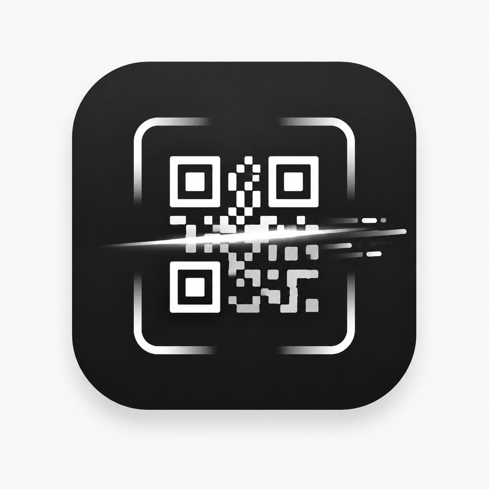
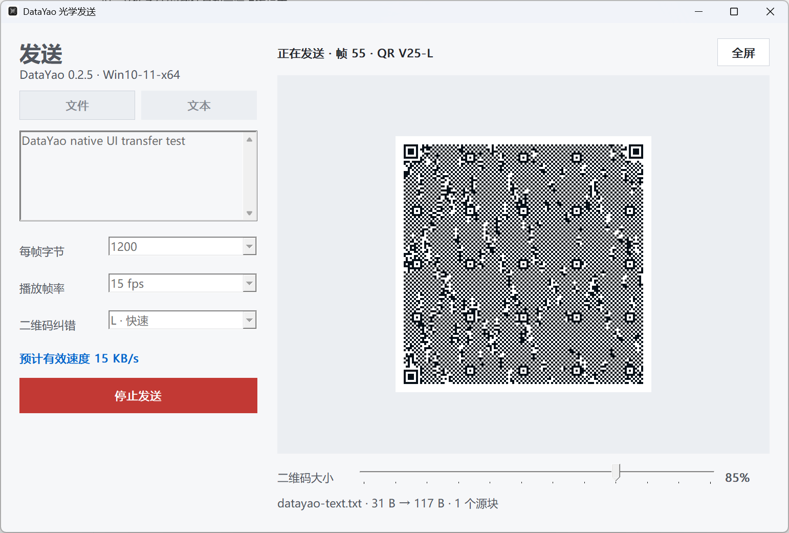

<p align="center">
  
</p>

<h1 align="center">DataYao</h1>

<p align="center">
  双端离线 · 稳定快速 · QR / 彩色 QR / 声音传输<br/>
  无需 Wi-Fi、蓝牙、移动网络或服务器，仅凭屏幕与摄像头，或扬声器与麦克风完成传输。
</p>

<p align="center">
  <a href="https://jensen-yao.github.io/DataYao/">在线体验</a> ·
  <a href="https://github.com/Jensen-Yao/DataYao/releases">下载发布版</a> ·
  <a href="#特性">特性</a> ·
  <a href="#使用方法">使用方法</a> ·
  <a href="#下载">下载</a>
</p>

<p align="center">
  <a href="https://jensen-yao.github.io/DataYao/">
    
  </a>
</p>

---

## 概述

DataYao 是一个双端离线的数据传输工具：发送端把文件或文本编码为标准动态 QR、三通道彩色 QR 或轻量声音帧，接收端使用摄像头或麦克风在本地恢复。传输链路不需要 Wi-Fi、蓝牙、移动网络或服务器，也不包含加密层，适合临时、低依赖的近距离数据搬运。

**在线体验：** [jensen-yao.github.io/DataYao](https://jensen-yao.github.io/DataYao/)

## 项目首页与在线使用

GitHub Pages 首页集中展示协议原理、接收诊断、平台差异和当前发布包。顶部导航可以直接进入完整的 Web 发送端与接收端：

- [打开项目首页](https://jensen-yao.github.io/DataYao/)
- [直接进入发送端](https://jensen-yao.github.io/DataYao/#send)
- [直接进入接收端](https://jensen-yao.github.io/DataYao/#receive)

Web 版首次加载后会缓存为 PWA，后续可离线运行。浏览器接收端需要 HTTPS 与摄像头权限；需要长期在隔离环境中使用时，建议提前打开一次页面完成缓存，或安装 Android 接收端 APK。Windows 原生便携版完全不依赖浏览器、WebView2 或网络，适合断网电脑和旧系统。

## 下载

| 平台 | 下载 | 说明 |
| :--- | :--- | :--- |
| Windows XP / 7 发送端 | [Legacy x86 ZIP](https://github.com/Jensen-Yao/DataYao/releases/download/v0.3.0/DataYao-0.3.0-Windows-XP-Win7-x86-Portable.zip) | 原生 32 位，约 815 KB，解压即用，不依赖运行库 |
| Windows 10 / 11 发送端 | [Modern x64 ZIP](https://github.com/Jensen-Yao/DataYao/releases/download/v0.3.0/DataYao-0.3.0-Windows-Win10-Win11-x64-Portable.zip) | 原生 64 位，约 1.12 MB，解压即用，不依赖 WebView2 |
| Android 接收端 | [Receiver APK](https://github.com/Jensen-Yao/DataYao/releases/download/v0.3.0/DataYao-Receiver-release.apk) | GitHub Actions 签名，仅接收模式，支持摄像头与麦克风 |
| HarmonyOS 接收端 | [HarmonyOS ZIP](https://github.com/Jensen-Yao/DataYao/releases/download/v0.3.0/DataYao-0.3.0-HarmonyOS-unsigned.zip) | 未签名开发验证包，需自行签名后上架 |
| Web / PWA | [GitHub Pages](https://jensen-yao.github.io/DataYao/) | 浏览器直接打开，可安装为 PWA |

> 完整发布列表见 [Releases](https://github.com/Jensen-Yao/DataYao/releases)。

## 特性

- **双端离线**：页面首次加载后由 Service Worker 缓存；光学传输阶段没有网络请求。
- **抗丢帧**：LT fountain code 允许帧乱序、丢失和重复，接收端收到足够独立方程即可恢复。
- **实时解码**：两个独立 Web Worker 使用 ZXing-C++ WASM 分析原始摄像头帧；解码繁忙时丢弃旧帧，不阻塞界面或积压延迟。
- **完整性校验**：每个 QR 帧带 CRC32，完整容器恢复后再做 SHA-256 校验。
- **文件与文本**：保留文件名和 MIME 类型；可选 gzip 压缩，文本支持直接复制。
- **可调参数**：每帧字节数、播放帧率和 QR 纠错等级可按屏幕、距离和相机能力调节。
- **便携操作**：发送端支持把文件直接拖入文件区；二维码显示尺寸可用滑块缩小，方便调整拍摄距离。
- **三种离线载波**：标准 QR 保持默认稳定路径；彩色 QR 每幅图并行承载三帧；声音模式用于 64 KB 内短数据兜底。
- **诊断面板**：实时显示采集、分析、二维码识别和有效帧计数，连续无识别时给出具体原因。
- **纯前端**：React + TypeScript + Vite，无后端、无账号、无遥测。

## 使用方法

1. 在发送设备打开页面，选择“文件”或“文本”，再选择 QR、彩色 QR 或声音载波。
2. QR 模式调整屏幕亮度并保持二维码完整显示；声音模式让接收设备靠近扬声器并保持环境安静。
3. 接收端选择相同载波，允许摄像头或麦克风权限；QR 模式优先使用后置摄像头。
4. 看到“接收完成”后，文本可复制，文件可保存。

## 便携版与移动端

### Windows 原生便携发送端

Windows 发送端采用同一套 Go/Win32 源码生成两个小型版本，解压后直接运行 `DataYao.exe`。它不写注册表，不要求 Node.js、.NET、WebView2、浏览器或网络连接；文件拖放、文本发送、标准/彩色动态二维码、轻量声音、每帧字节/FPS/ECC 调节、二维码缩放和全屏显示均保留。

- **Legacy x86**：使用 Go 1.10.8 和 `GO386=387` 构建，目标为 Windows XP SP3 / Windows 7 及其他 32 位老机器。
- **Modern x64**：使用 Go 1.26.5 x64 构建，目标为 Windows 10 / 11。

两者生成完全相同的 DataYao 协议帧，可由现有 Android、HarmonyOS 和 Web 接收端直接扫描。Windows 包只承担发送，因此接收端仍仅依赖手机摄像头，不需要与发送电脑联网。

本地生成：

```powershell
npm run package:native
```

产物位于 `artifacts/native/`，包括两个便携 ZIP、独立 EXE 和 `SHA256SUMS.txt`。构建会分别运行 Go 1.10.8/x86 与现代 Go/x64 协议测试、检查 PE 架构、注入统一产品 Logo，并执行二维码自测。

> Legacy EXE 已在当前 Windows 的 32 位兼容层完成启动和协议测试；正式发布前仍建议在真实 Windows XP SP3 与 Windows 7 虚拟机各做一次拖放、全屏和长时间播放测试。

### Android 接收端 APK

Android 工程使用 Capacitor，构建时设置 `VITE_RECEIVER_ONLY=1`，启动后直接进入接收页并隐藏发送入口。QR 模式申请摄像头权限，声音模式申请麦克风权限。仓库的 `.github/workflows/android.yml` 会在 GitHub Actions 中安装 Android SDK、构建 release APK、使用 GitHub Actions Secrets 中的 JKS 发布密钥签名，生成 provenance，并在标签构建后上传到对应 GitHub Release。

APK 最低支持 Android 7.0（API 24）。QR 扫描建议使用支持连续自动对焦、至少能输出 720p 画面的后置摄像头；声音接收建议让手机靠近发送端扬声器。保存文件时调用 Android 系统文件选择器，不需要存储权限。接收过程在内存中恢复文件，接近 64 MB QR 上限时需要为应用保留足够可用内存。

需要配置的仓库 Secrets：

```text
ANDROID_KEYSTORE_BASE64
ANDROID_KEYSTORE_PASSWORD
ANDROID_KEY_ALIAS
ANDROID_KEY_PASSWORD
```

构建工作流支持手动触发或推送 `v*` 标签。下载 APK 后可以用 GitHub CLI 验证 provenance：

```bash
gh attestation verify DataYao-Receiver-release.apk -R Jensen-Yao/DataYao
```

APK 的签名用于确认发布者和升级来源，不会对光学传输内容加密；传输协议仍按设计保持明文并使用 SHA-256 做完整性校验。

### HarmonyOS 接收端

仓库包含独立的 `harmony/` 鸿蒙 Stage 工程，复用同一套接收、QR/声音解码、LT Fountain 和校验核心，默认仅显示接收模式。鸿蒙原生层处理 ArkWeb 摄像头与麦克风授权、系统剪贴板和文档选择器保存文件。

建议在 DevEco Studio 中直接打开 `harmony/` 目录。命令行构建：

```powershell
npm.cmd run build:harmony
```

构建会先生成 `VITE_RECEIVER_ONLY=1` 的离线 Web 资源，再同步到 `harmony/entry/src/main/resources/rawfile/datayao/`，最后调用本机 Hvigor。未配置 DataYao 专属 AGC Profile 时，产物会明确标记为 `*-HarmonyOS-unsigned.app`，仅用于本地安装和验证；上架必须使用与 `io.github.jensenyao.datayao` 匹配的独立签名材料，不能复用其他应用的 `.p12`、`.p7b` 或密码。

### 摄像头与 HTTPS

浏览器通常只会在安全上下文中开放摄像头权限。GitHub Pages 默认提供 HTTPS；本地开发请使用 `localhost`，或通过 HTTPS 反向代理访问。发送端可以完全离线运行，接收端第一次打开页面仍需要先把应用资源缓存到本机。

## 稳定性调优

默认参数为 **1200 bytes/frame、15 fps、ECC-L**，优先保证手机摄像头的实拍识别率。

- 识别困难、距离较远或屏幕较小：降低每帧字节数到 800/1200，帧率降到 10/15，纠错改为 M。
- 光线充足、设备性能较好：可尝试 2000/2300 bytes 和 24/30 fps。
- 保持二维码四周留白，避免浏览器缩放、系统护眼滤镜和屏幕反光。
- 接收页会请求连续自动对焦，并显示采集、分析、二维码、有效帧和忙时丢帧计数，便于判断参数是否合适。

彩色 QR 每幅图叠加三张相同尺寸的 QR 矩阵，理论有效速率约为标准 QR 的三倍，但更依赖屏幕色彩、相机白平衡和对焦。出现识别波动时应先切回标准 QR；关闭护眼、夜间色温和高对比度滤镜。

声音模式是无摄像头或屏幕链路不可用时的短数据兜底，限制为 **64 KB**，典型有效速率约 **8–12 B/s**。它不适合大文件；优先传文本、口令材料之外的公开配置或很小的文件，并保持近距离、安静环境与较高扬声器音量。

普通浏览器扫码能识别静态网址，不代表一定能识别 DataYao 默认数据帧：数据帧包含约 1 KB 二进制载荷，二维码密度显著高于常见网址码，并且画面持续变化。可按下面的计数定位问题：

- **采集一直为 0**：摄像头没有提供视频帧，检查权限、摄像头占用或 ArkWeb/WebView 兼容性。
- **采集增长、分析一直为 0**：ZXing Worker/WASM 没有返回；重启应用并确认安装包完整，界面会在 8 秒后报告具体解码器错误。
- **分析增长、二维码一直为 0**：解码器正常，但构图、对焦、反光或二维码密度不合适；让二维码占画面宽度 40%–80%，先降到 800/1200 B 和 10/15 fps。
- **二维码增长、有效帧为 0**：相机看到了二维码，但不是 DataYao 帧或协议版本不匹配。
- **有效帧增长但进度较慢**：链路已经正常，继续播放或降低帧率，减少运动模糊和重复帧。

## 协议概要

每个 DataYao 帧由固定头和一个 fountain block 组成。标准 QR 一图一帧；彩色 QR 把连续三帧分别写入 R/G/B 通道；声音模式给同一 DataYao 帧再增加长度与 CRC32 声音封装。头部包含 magic/version、会话 ID、序号、块数、块大小、总长度、CRC32 和 flags。接收端最终都进入同一 LT Fountain 解码器，因此不依赖帧顺序，也不需要建立双向连接。

文件容器保存文件名、MIME、原始长度、压缩标记和 SHA-256。当前单次传输限制为 **64 MB**；文本输入限制为 **4 MiB**。这是完整性校验，不是加密：传输内容可被看到，也不会隐藏元数据。

## 本地开发

```bash
npm ci
npm run dev
```

常用校验命令：

```bash
npm run typecheck
npm test
npm run build
npm run test:optical
npm run preview
npm run package:portable
npm run package:native
npm run build:android
npm run build:harmony
```

## 目录结构

```text
src/components/  发送端和接收端 UI
src/core/        QR、协议、CRC/SHA-256、LT fountain code
src/workers/     ZXing WASM 解码 Worker
desktop/         Electron 主进程和 Windows 便携包脚本
native-sender/   XP/Win7 x86 与 Win10/11 x64 原生发送端源码
android/         Capacitor Android 接收端工程
harmony/         HarmonyOS Stage 接收端工程
scripts/         跨平台构建、鸿蒙资源同步、图标生成脚本
build/           生成的 Windows 混合格式 ICO 图标
logo/            所有产品端的品牌 Logo 唯一源文件
public/          PWA 静态资源和品牌 Logo 副本
.github/workflows Pages、Windows Portable、Android APK 工作流
```

## 限制与隐私

- 这是单向视觉/声音通道；发送端不会收到接收端 ACK，丢帧通过 fountain 冗余抵消。
- 传输速度受二维码尺寸、屏幕刷新率、相机帧率和环境光影响。
- 页面不提供加密或身份认证，请勿传输需要保密的内容。
- 应用不上传文件、不调用后端 API；浏览器摄像头画面只在本地处理。

## 更新日志

- **v0.3.0**：新增三通道彩色 QR 与轻量 DTMF 声音模式；Web、Android、HarmonyOS 接收三种载波，两个原生 Windows 发送端保持小体积；补充麦克风权限、声音 CRC32、跨通道测试和动态限制提示。
- **v0.2.5**：新增约 2 MB 的 XP/Win7 x86 与约 3 MB 的 Win10/11 x64 原生便携发送端；补全 Windows、Android、HarmonyOS 统一品牌图标，并支持从 `logo/logo.jpg` 一键生成。
- **v0.2.4**：更换产品 Logo；更新 PWA 图标与 favicon；同步 Windows、Android、HarmonyOS 版本号。
- **v0.2.3**：接收端改用 ZXing-C++ WASM 双 Worker 解码；默认参数调整为 1200 B / 15 fps；新增光学回环测试。
- **v0.2.2**：扫描失败显示具体原因；Android 文件保存改用系统文件选择器。
- **v0.2.1**：接收端启动后扫描画面自动置顶；发送端新增二维码缩放与文件拖放。

## 实现参考

实时采集与解码架构参考了 [decimen-optical-transfer](https://github.com/bashalarmistalt/decimen-optical-transfer) 的原始分辨率帧、`requestVideoFrameCallback`、多 Worker 和忙时丢帧设计；同时对照了 [qrcode-file-transfer](https://github.com/ganlvtech/qrcode-file-transfer) 与 [qr-scanner](https://github.com/nimiq/qr-scanner) 的相机采集实现。DataYao 的传输协议、LT fountain code、容器与界面为本项目实现。

## 许可

[MIT License](LICENSE)
